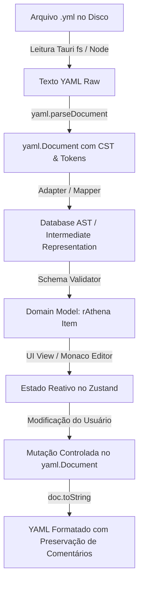

# Comparação e Estratégia de Parser e Serializer YAML

**Status**: Verified e Recomendado para o rAthena Studio.  
**Objetivo**: Definir a biblioteca e o padrão de manipulação de documentos YAML para garantir integridade, performance e preservação de estilo.

---

## 1. Avaliação Comparativa de Opções no Ecossistema TypeScript / Node / Tauri

| Critério | `yaml` (eemeli/yaml v2) | `js-yaml` | `yaml-ast-parser` | Custom Parser |
| :--- | :--- | :--- | :--- | :--- |
| **Padrão YAML** | YAML 1.2 e 1.1 completo | YAML 1.2 | YAML 1.1 antigo | Indefinido / Frágil |
| **Suporte a AST / CST** | **Sim** (Árvore de Sintaxe Concreta e AST completa) | Não (Apenas conversão direta JS Object) | Sim (Básico) | N/A |
| **Preservação de Comentários** | **Excelente** (Comentários de bloco, linha e trailing anexados aos nós) | **Não** (Descarta todos os comentários) | Parcial | Complexo / Propenso a falhas |
| **Localização de Nós (Source Map/Ranges)** | **Sim** (Offsets de caractere e linha/coluna exatos para Monaco Editor) | Não | Sim | N/A |
| **Edição Incremental / In-Place** | **Sim** (`doc.setIn(...)`, `doc.getIn(...)`, mutação de nós preservando formatação) | Não (Re-serializa o objeto inteiro) | Difícil (read-only focado) | N/A |
| **Preservação de Estilo (Quotes, Folded/Literal Strings `|`)** | **Sim** (Mantém estilo de aspas e formato de bloco literal para scripts) | Não (Normaliza com regras globais) | Não | N/A |
| **Suporte a TypeScript** | Tipagem completa nativa em TypeScript | Tipagem `@types/js-yaml` | Parcial | Manual |
| **Performance em Arquivos Grandes** | Alta (Parser em streaming / eventos de tokens) | Muito alta | Média/Baixa | Variável |
| **Manutenção e Comunidade** | Biblioteca padrão da fundação OpenJS/npm | Mantida, mas focada em dados simples | Abandonada | Custo de manutenção infinito |
| **Compatibilidade Tauri / Vite** | 100% puro JS/TS (Zero dependências nativas C/Node gyp) | 100% puro JS | 100% puro JS | 100% |

---

## 2. Recomendação Técnica: `yaml` (eemeli/yaml)

A recomendação definitiva para o Database Engine do rAthena Studio é a utilização da biblioteca **`yaml` (v2.x)**.

### Razoes Arquiteturais:
1. **Manipulação Baseada em `yaml.Document`**:
   Permite carregar o arquivo em memória como um `Document` preservando a árvore sintática concreta (CST), comentários de cabeçalho, comentários entre itens e estilo de quebras de linha (`|` literal block para scripts de rAthena).
2. **Edição Não-Destrutiva**:
   Quando o usuário edita apenas um campo de um item (por exemplo, altera `Weight: 50` para `Weight: 70`), o `yaml.Document` atualiza especificamente o valor do nó sem reformatar o restante do arquivo nem apagar anotações e comentários dos desenvolvedores.
3. **Mapeamento Bidirecional com Monaco Editor**:
   Os nós do `yaml.Document` expõem os ranges (`[startOffset, endOffset]`). Isso permite vincular o cursor do Monaco Editor diretamente à entidade visual selecionada na UI e vice-versa.

---

## 3. Padrão de Integração do Parser na Arquitetura do rAthena Studio

### Regra de Ouro da Serialização:
- **Nunca fazer `JSON.stringify` -> `yaml.stringify` no arquivo inteiro**.
- Todo fluxo de alteração de arquivo existente deve operar sobre a instância de `yaml.Document` carregada daquele arquivo para preservar integridade textual e semântica.
