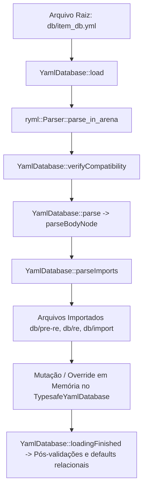

# Formato de Databases YAML do rAthena — Especificação Técnica

**Status**: Verified contra o código-fonte do rAthena (`horizonro` / rAthena upstream).  
**Data da Investigação**: 25 de Agosto de 2026.  
**Fontes Auditadas**: `src/common/database.hpp`, `src/common/database.cpp`, `src/map/itemdb.hpp`, `src/map/itemdb.cpp`, `src/map/mob.cpp`, `src/map/pc.cpp`, `src/map/script_constants.hpp`.

---

## 1. Visão Geral da Arquitetura de Databases do rAthena

O rAthena utiliza a biblioteca C++ `rapidyaml` (`ryml`) para carregamento de arquivos de banco de dados estruturados em YAML.

A arquitetura base é centrada na classe abstrata `YamlDatabase` e suas especializações genéricas `TypesafeYamlDatabase<keytype, datatype>` e `TypesafeCachedYamlDatabase<keytype, datatype>`.



---

## 2. Estrutura Canônica de um Arquivo YAML do rAthena

Todo arquivo de database rAthena possui até 3 seções de nível raiz (top-level):

```yaml
Header:
  Type: DATABASE_TYPE       # Obrigatório
  Version: 3                # Obrigatório (uint16)
  Clear: false              # Opcional (bool)

Body:
  - Id: 1001                # Sequência de entidades
    ...

Footer:
  Imports:                  # Lista ordenada de arquivos a importar
    - Path: db/pre-re/item_db.yml
      Mode: Prerenewal
    - Path: db/re/item_db.yml
      Mode: Renewal
    - Path: db/import/item_db.yml
```

---

## 3. Contrato da Seção `Header`

| Campo | Tipo | Obrigatoriedade | Descrição e Regras |
| :--- | :--- | :--- | :--- |
| `Type` | `string` | **Obrigatório** | Identificador do banco de dados (ex: `ITEM_DB`, `MOB_DB`, `SKILL_TREE_DB`). Deve ser idêntico à constante declarada no construtor da classe C++. Se divergente, o rAthena rejeita o arquivo (`Database type mismatch`). [Verified] |
| `Version` | `uint16` | **Obrigatório** | Versão do schema do arquivo. Validada contra `this->version` (versão atual) e `this->minimumVersion` (versão mínima suportada). [Verified] |
| `Clear` | `bool` | **Opcional** (Default: `false`) | Se `true`, invoca `this->clear()` no início do carregamento do arquivo, limpando completamente todos os dados carregados em memória antes de processar o `Body`. Muito utilizado em arquivos de customização e importação total. [Verified] |

### Regras de Compatibilidade de Versão no rAthena (`verifyCompatibility`)
- `tmpVersion > this->version`: **ERRO FATAL**. Carregamento abortado.
- `tmpVersion < this->minimumVersion`: **ERRO FATAL**. Carregamento abortado.
- `minimumVersion <= tmpVersion < this->version`: **WARNING**. Emite alerta de schema desatualizado e prossegue com compatibilidade reduzida.

---

## 4. Contrato da Seção `Footer` e Sistema de `Imports`

A seção `Footer.Imports` define dependências e camadas de carregamento:

| Campo | Tipo | Descrição |
| :--- | :--- | :--- |
| `Path` | `string` | Caminho relativo à raiz do servidor rAthena (ex: `db/import/item_db.yml`). [Verified] |
| `Mode` | `string` | Opcional (`Prerenewal` ou `Renewal`). Se especificado, o rAthena avalia se `#ifdef RENEWAL` coincide com o modo compilado. Se divergente, o arquivo é ignorado silenciosamente. [Verified] |
| `Generator` | `bool` | Opcional. Indica arquivos gerados automaticamente; carregados apenas quando geradores de dados estiverem ativos. [Verified] |

---

## 5. Mecânica Real de Herança e Sobrescrita (Inheritance & Overrides)

### 5.1 No Banco de Itens (`item_db.yml`)
- **Não há palavra-chave `Inherit` nos nós de itens**.
- A herança/override ocorre por **Camadas de Carregamento por ID (Layered ID In-Place Mutation)**.
- Quando um arquivo posterior (ex: `db/import/item_db.yml` ou `db/re/item_db_equip.yml`) define uma entrada com um `Id` que já existe no repositório em memória:
  1. O rAthena obtém a instância existente: `std::shared_ptr<item_data> item = this->find(nameid);`
  2. `exists` torna-se `true`.
  3. Os campos `AegisName` e `Name` tornam-se **opcionais**.
  4. Apenas os campos explicitamente presentes no nó YAML sobrescrevem os valores anteriores.
  5. Campos omitidos no nó de importação **mantêm os valores pré-existentes**.
- **Remoção de Itens**: Não há comando nativo de deleção granular via YAML além de `Header: { Clear: true }` ou marcar o item como indisponível/sobrescrever valores. [Verified]

### 5.2 Em Outros Bancos de Dados (Ex: `skill_tree.yml`, `pc_groups.yml`)
- `skill_tree.yml` utiliza o nó `Inherit: { JobName: true }` para clonar nós de árvore de habilidades de classes anteriores com resolução de conflitos em `loadingFinished`. [Verified]
- `pc_groups.yml` utiliza `Inherit: [ GroupName ]` com grafo de resolução cíclica de permissões. [Verified]

---

## 6. Tratamento de Erros, Validações e Campos Desconhecidos

| Cenário | Comportamento do rAthena | Classificação |
| :--- | :--- | :--- |
| **Campo desconhecido no YAML** (ex: `CustomMeta: "foo"`) | `ryml` processa o nó, mas a lógica C++ consulta apenas chaves esperadas via `nodeExists(...)`. O campo desconhecido é **silenciosamente ignorado** sem emitir warning e sem crash. | **Verified** |
| **Item novo sem `AegisName` ou `Name`** | `nodesExist(node, {"AegisName", "Name"})` falha, emite `ShowError` e ignora o item (retorna 0). | **Verified** |
| **`AegisName` duplicado entre IDs distintos** | Emite `invalidWarning` ("Found duplicate item Aegis name for %s, skipping") e ignora a inserção. | **Verified** |
| **Nome > 50 caracteres (`ITEM_NAME_LENGTH - 1`)** | Emite warning e trunca/limita em 50 caracteres (`capping...`). | **Verified** |
| **Enum / Constante de Script inválida** | Emite warning de valor inválido e aplica fallback padrão (ex: `IT_ETC` para Type inválido, `W_FIST` para SubType inválido, `SEX_BOTH` para Gender inválido). | **Verified** |
| **Valores numéricos fora do limite** | Trunca nos valores máximos (`MAX_ZENY`, `MAX_SLOTS`, `MAX_LEVEL`, `DEFTYPE_MAX`, `AREA_SIZE`). | **Verified** |

---

## 7. Classificação de Certeza (Epistemologia Técnica)

- **[Verified]**: Comportamento verificado linha por linha no código-fonte C++ (`src/common/database.cpp`, `src/map/itemdb.cpp`, etc.) e validado contra arquivos YAML oficiais.
- **[Inferred]**: Padrões de formatação visual padrão adotados pelo rAthena (ex: indentação de 2 espaços, bloco literal `|` para scripts multilinha).
- **[Unknown]**: Comportamentos de plugins proprietários de terceiros que modifiquem `itemdb.cpp` além do código-base padrão.
