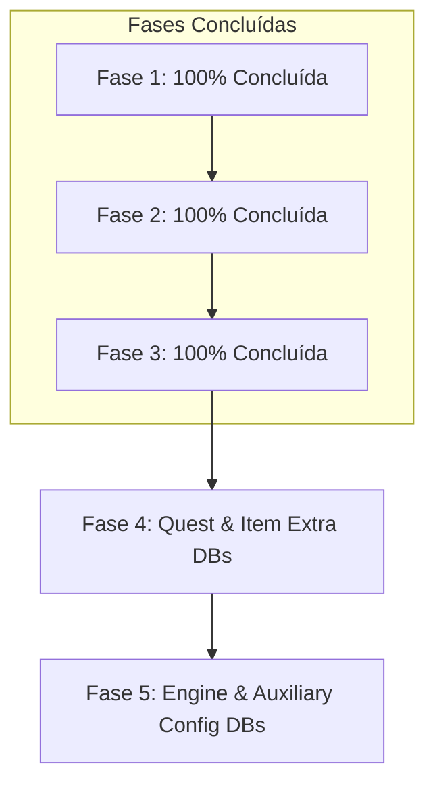

# Auditoria de Esquemas e Cobertura de Campos: rAthena Studio vs `horizonro/db`

Data da auditoria: 2026-08-27  
Repositório de dados auditado: `C:\Users\artur.vale\OneDrive - SISTEMA FIEPA\Documentos\Pessoal\github\horizonro\db`  
Projeto: `rAthena Studio`

---

## 1. Diagnóstico Geral do Sistema

| Camada | Estado Atual no rAthena Studio | Cobertura |
| :--- | :--- | :--- |
| **Item Database (`ITEM_DB`)** | Todos os 33 campos, subestruturas (`Flags`, `Trade`, `Delay`, etc.), maps (`Jobs`, `Classes`, `Locations`), editores de script com autocomplete e componentes Shadcn Select. | **100% (Fase 1 Concluída)** |
| **Monster Database (`MOB_DB`)** | Tipagem completa (`MobRawFields`), multi-camadas, editor de identidade, atributos, EXP, modos de IA (`01`-`27`) com tooltips em PT-BR, tabelas de Drops & MVP com % em tempo real e serialização YAML tolerante. | **100% (Fase 2 Concluída)** |
| **Skill Database (`SKILL_DB`)** | Tipagem completa (`SkillRawFields`), parser AST, repositório multi-camadas, timings escalares e matriciais por nível, custos de recursos, catalisadores e armas, áreas de efeito e unidades de solo. | **100% (Fase 3 Concluída)** |
| **Quest Database (`QUEST_DB`)** | Identificador declarado em `DatabaseProviderId`, sem provider/parser/UI. | 0% (Fase 4) |
| **Instance Database (`INSTANCE_DB`)** | Identificador declarado em `DatabaseProviderId`, sem provider/parser/UI. | 0% (Fase 5) |
| **Demais Bancos e Tabelas Auxiliares (35+)** | Mapeados no catálogo técnico de esquemas. | 0% (Fase 5) |

---

## 2. Item Database (`ITEM_DB`): Matriz Completa de Campos

Aplica-se aos arquivos: `item_db.yml`, `item_db_equip.yml`, `item_db_usable.yml`, `item_db_etc.yml`, `item_db_bg.yml`, `item_db_vendsystem.yml`.

### 2.1 Campos Primitivos e de Status

| Campo | Tipo / Formato | Suporte no Engine (`itemTypes.ts`) | Suporte no Editor (`ItemInspector.tsx`) | Status |
| :--- | :--- | :---: | :---: | :--- |
| `Id` | `number` (Int > 0) | ✅ | ✅ (Readonly) | ✅ Implementado |
| `AegisName` | `string` (max 50) | ✅ | ✅ (`ItemIdentitySection.tsx`) | ✅ Implementado |
| `Name` | `string` (max 50) | ✅ | ✅ (`ItemIdentitySection.tsx`) | ✅ Implementado |
| `Type` | Enum (`ITEM_TYPES`) | ✅ | ✅ (Shadcn `Select`) | ✅ Implementado |
| `SubType` | Enum / `string` | ✅ | ✅ (Shadcn `Select` contextual) | ✅ Implementado |
| `Buy` | `number` (Zeny) | ✅ | ✅ (`ItemIdentitySection.tsx`) | ✅ Implementado |
| `Sell` | `number` (Zeny) | ✅ | ✅ (`ItemIdentitySection.tsx`) | ✅ Implementado |
| `Weight` | `number` (10 = 1.0) | ✅ | ✅ (`ItemIdentitySection.tsx`) | ✅ Implementado |
| `Slots` | `number` (0..4) | ✅ | ✅ (`ItemIdentitySection.tsx`) | ✅ Implementado |
| `WeaponLevel` | `number` (0..5) | ✅ | ✅ (`ItemCombatSection.tsx`) | ✅ Implementado |
| `ArmorLevel` | `number` (0..2) | ✅ | ✅ (`ItemCombatSection.tsx`) | ✅ Implementado |
| `Attack` | `number` | ✅ | ✅ (`ItemCombatSection.tsx`) | ✅ Implementado |
| `MagicAttack` | `number` | ✅ | ✅ (`ItemCombatSection.tsx`) | ✅ Implementado |
| `Defense` | `number` (0..1000) | ✅ | ✅ (`ItemCombatSection.tsx`) | ✅ Implementado |
| `Range` | `number` (0..14) | ✅ | ✅ (`ItemCombatSection.tsx`) | ✅ Implementado |
| `EquipLevelMin` | `number` (0..999) | ✅ | ✅ (`ItemRequirementsSection.tsx`) | ✅ Implementado |
| `EquipLevelMax` | `number` (0..999) | ✅ | ✅ (`ItemRequirementsSection.tsx`) | ✅ Implementado |
| `Gender` | `'Male' \| 'Female' \| 'Both'` | ✅ | ✅ (`ItemRequirementsSection.tsx`) | ✅ Implementado |
| `Refineable` | `boolean` | ✅ | ✅ (`ItemCombatSection.tsx`) | ✅ Implementado |
| `Gradable` | `boolean` | ✅ | ✅ (`ItemCombatSection.tsx`) | ✅ Implementado |
| `View` | `number` | ✅ | ✅ (`ItemIdentitySection.tsx`) | ✅ Implementado |
| `AliasName` | `string` | ✅ | ✅ (`ItemIdentitySection.tsx`) | ✅ Implementado |

### 2.2 Mapas e Dicionários de Requisitos (Bitmasks / Checklists)

| Estrutura | Formato YAML | Estado na UI | Status |
| :--- | :--- | :---: | :--- |
| `Jobs` | `Record<string, boolean>` (`All: true` ou lista de jobs) | ✅ Grid de 30 classes com toggle `All` (`ItemRequirementsSection.tsx`) | ✅ Implementado |
| `Classes` | `Record<string, boolean>` (`All: true` ou lista de classes) | ✅ Grid de 8 categorias com toggle `All` (`ItemRequirementsSection.tsx`) | ✅ Implementado |
| `Locations` | `Record<string, boolean>` (Lista de slots de equip) | ✅ Grid de 22 slots visuais de equipamento (`ItemRequirementsSection.tsx`) | ✅ Implementado |

### 2.3 Subestruturas e Objetos Aninhados

| Objeto | Sub-propriedades | Estado na UI | Status |
| :--- | :--- | :---: | :--- |
| `Flags` | `BuyingStore`, `DeadBranch`, `Container`, `UniqueId`, `BindOnEquip`, `DropAnnounce`, `NoConsume`, `DropEffect` | ✅ Card colapsável com switches e dropdown (`ItemSubstructuresSection.tsx`) | ✅ Implementado |
| `Delay` | `Duration` (number), `Status` (string) | ✅ Card colapsável `Delay` (`ItemSubstructuresSection.tsx`) | ✅ Implementado |
| `Stack` | `Amount`, `Inventory`, `Cart`, `Storage`, `GuildStorage` | ✅ Card colapsável `Stack` (`ItemSubstructuresSection.tsx`) | ✅ Implementado |
| `NoUse` | `Override` (number), `Sitting` (bool) | ✅ Card colapsável `NoUse` (`ItemSubstructuresSection.tsx`) | ✅ Implementado |
| `Trade` | `Override`, `NoDrop`, `NoTrade`, `TradePartner`, `NoSell`, `NoCart`, `NoStorage`, `NoGuildStorage`, `NoMail`, `NoAuction` | ✅ Card colapsável de permissões e restrições (`ItemSubstructuresSection.tsx`) | ✅ Implementado |

### 2.4 Blocos de Script do rAthena

| Campo | Formato | Estado na UI | Status |
| :--- | :--- | :---: | :--- |
| `Script` | Multiline rAthena Script (`>-\n ...`) | ✅ Editor em abas com numeração de linhas, autocomplete (`item_bonus.txt`), linter e auto-fix (`ItemScriptEditorSection.tsx`) | ✅ Implementado |
| `EquipScript` | Multiline rAthena Script | ✅ Editor em abas dedicado (`ItemScriptEditorSection.tsx`) | ✅ Implementado |
| `UnEquipScript` | Multiline rAthena Script | ✅ Editor em abas dedicado (`ItemScriptEditorSection.tsx`) | ✅ Implementado |

---

## 3. Catálogo de Todos os Bancos de Dados em `horizonro/db`

### 3.1 Entidades Principais de Jogo

#### `mob_db.yml` (`MOB_DB` v3) — **100% Implementado (Fase 2)**
* **Arquivos**: `db/mob_db.yml`, `db/re/mob_db.yml`, `db/pre-re/mob_db.yml`, `db/import/mob_db.yml`.
* **Campos Suportados**:
  * Identificação: `Id`, `AegisName`, `Name`, `JapaneseName`.
  * Estatísticas: `Level`, `Hp`, `Sp`, `BaseExp`, `JobExp`, `MvpExp`.
  * Combate: `Attack`, `Attack2`, `Defense`, `MagicDefense`, `Resistance`, `MagicResistance`.
  * Atributos: `Str`, `Agi`, `Vit`, `Int`, `Dex`, `Luk`.
  * Alcance e Movimento: `AttackRange`, `SkillRange`, `ChaseRange`, `WalkSpeed`, `AttackDelay`, `AttackMotion`, `DamageMotion`, `DamageTaken`.
  * Classificação: `Size` (Small/Medium/Large), `Race`, `RaceGroups` (Map de 34 grupos), `Element`, `ElementLevel`, `Ai` (`01`-`27`), `Class`, `Modes` (Map de 24 modos com tooltips em PT-BR).
  * Tabelas de Drop:
    * `Drops`: Lista de `{ Item, Rate, StealProtected, RandomOptionGroup, Index }`.
    * `MvpDrops`: Lista de `{ Item, Rate, RandomOptionGroup, Index }`.

#### `skill_db.yml` (`SKILL_DB` v3) — **100% Implementado (Fase 3)**
* **Arquivos**: `db/skill_db.yml`, `db/re/skill_db.yml`, `db/pre-re/skill_db.yml`, `db/import/skill_db.yml`.
* **Campos Suportados**:
  * Identificação: `Id`, `Name` (AegisName), `Description`, `MaxLevel`, `Status`.
  * Mecânicas & Execução: `Type` (`Weapon`, `Magic`, `Misc`, `None`), `TargetType` (`Passive`, `Attack`, `Ground`, `Self`, `Support`, `Trap`, `Target_Or_Ground`), `Hit` (`Normal`, `Single`, `Continuous`, `None`), `CastCancel`, `CastDefenseReduction`.
  * Timings & Delays (Escalares ou Matrizes progressivas 1..MaxLevel): `CastTime`, `FixedCastTime`, `AfterCastActDelay`, `AfterCastWalkDelay`, `Duration1`, `Duration2`, `Cooldown`.
  * Requisitos & Custos: `SpCost`, `HpCost`, `ApCost`, `SpRateCost`, `HpRateCost`, `ZenyCost`, `SpiritSphereCost`, `Weapon` (checklist de armas com toggle All), `ItemCost` (tabela de catalisadores com Add/Remove).
  * Área & Unidades: `Range`, `HitCount`, `Element`, `SplashArea`, `Knockback`, `ActiveInstance`, `GiveAp`, `Unit` (`Id`, `Layout`, `Range`, `Interval`, `Target`), `DamageFlags`, `Flags`, `CopyFlags` (`Plagiarism`, `Reproduce`).

#### `quest_db.yml` (`QUEST_DB` v3) — **Fase 4**
* **Arquivos**: `db/quest_db.yml`, `db/re/quest_db.yml`, `db/pre-re/quest_db.yml`.
* **Campos Requeridos**: `Id`, `Name`, `Title`, `TimeLimit`, `Targets: [{ Id, Count }]`, `Drops: [{ Item, Count, Rate }]`.

---

### 3.2 Sistemas de Itens, Encantamentos e Opções Randômicas

| Arquivo / Banco | Header Type | Campos Principais |
| :--- | :--- | :--- |
| `item_combos.yml` | `ITEM_COMBOS_DB` | `Combo: [Item1, Item2, ...]`, `Script` |
| `item_group_db.yml` | `ITEM_GROUP_DB` | `Group`, `SubGroup`, `List: [{ Item, Rate, Amount, Duration, Announce, UniqueId, Bound, RandomOptionGroup }]` |
| `item_packages.yml` | `ITEM_PACKAGES` | `Package`, `RandomOptions: { Count, List: [...] }`, `Groups: [{ Count, Index, List: [...] }]` |
| `item_randomopt_db.yml` | `RANDOM_OPTION_DB` | `Id`, `Option`, `Script` |
| `item_randomopt_group.yml` | `RANDOM_OPTION_GROUP` | `Id`, `Group`, `Slots: [{ Slot, Options: [{ Option, MinValue, MaxValue, Param, Chance }] }]`, `MaxRandom` |
| `item_reform.yml` | `ITEM_REFORM` | `Id`, `Item`, `RefineMin`, `Result`, `BaseRefine`, `KeepEnchants`, `Materials: [{ Item, Amount, RefineMin }]` |
| `item_enchant.yml` | `ITEM_ENCHANT` | `Id`, `Item`, `Slots: [{ Slot, Options: [...] }]`, `Reset: { Chance, Fee }` |
| `item_cash.yml` | `ITEM_CASH_DB` | `Tab`, `Item`, `Price` |

---

### 3.3 Entidades Auxiliares (Pets, Homunculus, Mercenários, Elementais)

| Arquivo / Banco | Header Type | Campos Principais |
| :--- | :--- | :--- |
| `pet_db.yml` | `PET_DB` | `Mob`, `EggItem`, `TameItem`, `FoodItem`, `Accessory`, `HungryDelay`, `Hunger`, `Intimacy`, `CaptureRate`, `SpecialEvolve`, `AutoFeed`, `Script`, `SupportScript`, `Evolution` |
| `homunculus_db.yml` | `HOMUNCULUS_DB` | `Id`, `Name`, `Food`, `HungryDelay`, `Intimacy`, `Evolution`, `BaseStats`, `StatGrows` |
| `mercenary_db.yml` | `MERCENARY_DB` | `Id`, `Name`, `Level`, `Hp`, `Sp`, `Attack`, `Attack2`, `Defense`, `MagicDefense`, `Stats`, `Range`, `WalkSpeed`, `AttackDelay` |
| `elemental_db.yml` | `ELEMENTAL_DB` | `Id`, `Name`, `Level`, `Hp`, `Sp`, `Attack`, `Attack2`, `Defense`, `MagicDefense`, `Stats`, `Range`, `WalkSpeed` |

---

### 3.4 Instâncias, PvP e Sistemas Sociais

| Arquivo / Banco | Header Type | Campos Principais |
| :--- | :--- | :--- |
| `instance_db.yml` | `INSTANCE_DB` | `Id`, `Name`, `TimeLimit`, `IdleTimeOut`, `NoNpc`, `NoMapFlag`, `Destroyable`, `Enter: { Map, X, Y }` |
| `castle_db.yml` | `CASTLE_DB` | `Id`, `MapName`, `CastleName`, `CastleEvent`, `TriggerEvent` |
| `attendance.yml` | `ATTENDANCE_DB` | `Day`, `Item`, `Amount`, `Bound` |
| `reputation.yml` / `reputation_group.yml` | `REPUTATION_DB` | `Id`, `Name`, `Type`, `Points`, `Tiers: [{ Level, Points, Title, Cost }]` |
| `battleground_db.yml` | `BATTLEGROUND_DB` | `Id`, `Name`, `Type`, `MinPlayers`, `MaxPlayers`, `MinLevel`, `MaxLevel`, `Team1`, `Team2` |
| `achievement_db.yml` / `achievement_level_db.yml` | `ACHIEVEMENT_DB` | `Id`, `Group`, `Name`, `Targets`, `Condition`, `Score`, `TitleId`, `BuffId`, `Rewards` |
| `event_mapping_db.yml` | `EVENT_MAPPING_DB` | `Id`, `Name`, `EventPrefix` |

---

### 3.5 Mecânicas de Cálculo, Progressão e Configurações de Servidor

| Arquivo / Tabela | Propósito no Emulador |
| :--- | :--- |
| `enchantgrade.yml` | Taxas de chance, bônus e requisitos de nível do sistema de grau (Grade). |
| `refine.yml` | Taxas de sucesso de refino por nível de arma/armadura, minérios e bônus de ataque/defesa. |
| `job_stats.yml`, `job_bonus.yml`, `job_aspd.yml`, `job_exp.yml`, `job_basepoints.yml` | Tabelas de atributos base, bônus de job level, curvas de EXP e tabelas de ASPD por arma. |
| `level_penalty.yml` | Modificadores de EXP e Drop baseados na diferença de nível jogador/monstro. |
| `map_drops.yml` | Drops específicos ou modificadores vinculados a mapas geográficos. |
| `mob_item_ratio.yml` | Ajustes globais de taxa de drop por item e lista de monstros. |
| `mob_chat_db.yml`, `mob_summon.yml` | Diálogos de NPCs/monstros e tabelas de Dead Branch / Bloody Branch. |
| `size_fix.yml`, `attr_fix.yml` | Matrizes de dano por tamanho de arma (Small/Medium/Large) e afinidade elemental. |
| `skill_tree.yml`, `guild_skill_tree.yml` | Árvore de pré-requisitos de habilidades normais e de clã. |
| `statpoint.yml`, `status.yml`, `title_bonus.yml`, `stylist.yml` | Custo de pontos de atributos, status changes, bônus de títulos e paletas/estilos visuais. |
| `create_arrow_db.yml`, `spellbook_db.yml`, `magicmushroom_db.yml`, `laphine_*.yml` | Tabelas de receitas e sínteses de itens do servidor. |

---

## 4. Plano de Implementação Modular

### Roadmap de Execução & Checklist de Progresso:

#### [x] Fase 1: Suporte Completo a Campos do Item Database (`ITEM_DB`) — CONCLUÍDO (2026-08-27)
- [x] **1.1 Constantes de Domínio e Enums (`itemTypes.ts`)**
  - [x] Mapeamento completo de `RATHENA_JOBS` (30 classes do rAthena).
  - [x] Mapeamento completo de `RATHENA_CLASSES` (8 categorias de classe).
  - [x] Mapeamento completo de `RATHENA_LOCATIONS` (22 slots de equipamentos).
  - [x] Mapeamento completo de `RATHENA_DROP_EFFECTS` (9 efeitos).
- [x] **1.2 Seção de Identidade e Propriedades Básicas (`ItemIdentitySection.tsx`)**
  - [x] Campo `AliasName` (input string).
  - [x] Campo `View` (input number sprite ID).
  - [x] Dropdowns Shadcn `Select` para `Type` e `SubType` contextual por tipo.
- [x] **1.3 Seção de Combate e Refino (`ItemCombatSection.tsx`)**
  - [x] Campos numéricos: `Attack`, `MagicAttack`, `Defense`, `Range`.
  - [x] Níveis: `WeaponLevel` (0..5), `ArmorLevel` (0..2).
  - [x] Toggles booleanos: `Refineable`, `Gradable`.
- [x] **1.4 Seção de Requisitos e Restrições (`ItemRequirementsSection.tsx`)**
  - [x] Campos numéricos: `EquipLevelMin`, `EquipLevelMax`.
  - [x] Dropdown: `Gender` (`Male`, `Female`, `Both`).
  - [x] Componente visual de Checklist: `Jobs` (`All` toggle + grade de 30 jobs).
  - [x] Componente visual de Checklist: `Classes` (`All` toggle + grade de 8 classes).
  - [x] Componente visual de Grid: `Locations` (grade de 22 slots de equipamento).
- [x] **1.5 Seção de Subestruturas e Objetos Aninhados (`ItemSubstructuresSection.tsx`)**
  - [x] Card colapsável `Flags` (`BuyingStore`, `DeadBranch`, `Container`, `UniqueId`, `BindOnEquip`, `DropAnnounce`, `NoConsume`, `DropEffect`).
  - [x] Card colapsável `Delay` (`Duration`, `Status`).
  - [x] Card colapsável `Stack` (`Amount`, `Inventory`, `Cart`, `Storage`, `GuildStorage`).
  - [x] Card colapsável `NoUse` (`Override`, `Sitting`).
  - [x] Card colapsável `Trade` (`Override`, `NoDrop`, `NoTrade`, `TradePartner`, `NoSell`, `NoCart`, `NoStorage`, `NoGuildStorage`, `NoMail`, `NoAuction`).
- [x] **1.6 Seção de Editores de Script & IntelliSense (`ItemScriptEditorSection.tsx`)**
  - [x] Editor em abas para `Script`, `EquipScript`, `UnEquipScript` com numeração de linhas, mono font, inserção de tab e formatação de blocos YAML.
  - [x] Popup de autocompletion e sugestão em tempo real baseado em `doc/item_bonus.txt` (`ALL_SCRIPT_COMPLETIONS`).
  - [x] Validação sintática e de constantes rAthena em tempo real (`RathenaScriptValidator`).
  - [x] Barra de snippets rápidos (`+All Stats`, `+Max HP%`, `+ATK%`, `Full Heal`, etc.) e botão de Auto-Fix de ponto e vírgula.
- [x] **1.7 Navegação e Ergonomia (`ItemInspector.tsx`)**
  - [x] Barra de abas de navegação rápida: *General & Combat*, *Requirements*, *Flags & Trade*, *Scripts*, *Layers*.
  - [x] Menu de abas responsivo com `flex-wrap gap-1.5`.
  - [x] Histórico completo de `Undo` / `Redo` para todos os campos atômicos e aninhados.
  - [x] Prévia de alterações pendentes (*Semantic Diff*).
  - [x] Proveniência explícita na aba Layers com caminhos relativos de arquivo e lista de campos ativos.
- [x] **1.8 Filtros de Workspace & Tabela Virtual (`ItemToolbar.tsx` & `ItemVirtualList.tsx`)**
  - [x] Filtro por pasta (`All Folders`, `Import Folder`, `General`).
  - [x] Coluna `FOLDER` na listagem virtual com badges estilizados.
- [x] **1.9 Testes Automatizados e Validação Round-Trip**
  - [x] Validação de serialização e compatibilidade estrita com `horizonro/db`.

---

#### [x] Fase 2: Monster Database (`MOB_DB`) — CONCLUÍDO (2026-08-27)
- [x] **2.1 Tipos de Domínio e Enums Canônicos (`mobTypes.ts`)**
  - [x] Enums: `MOB_SIZES`, `MOB_RACES`, `MOB_ELEMENTS`, `MOB_CLASSES`.
  - [x] Mapeamento dos 34 grupos secundários de monstros (`MOB_RACE_GROUPS`).
  - [x] Mapeamento de todos os 24 modos de IA e comportamento (`MOB_MODES`).
  - [x] Interface `MobRawFields` com cobertura de 100% dos campos.
- [x] **2.2 Parser & Serializador YAML Tolerante (`mobDatabaseParser.ts` & `mobDatabaseSerializer.ts`)**
  - [x] Validação de cabeçalho `Header` (Tipo `MOB_DB`, Versão 3).
  - [x] Tolerância a chaves de mapa duplicadas (`uniqueKeys: false`).
  - [x] Preservação de AST, numeração de linhas, formatação de blocos e injeção atômica de nós.
- [x] **2.3 Repositório em Camadas (`LayeredMobRepository.ts`) & Provedor (`MobDatabaseProvider.ts`)**
  - [x] Resolução multi-camadas de herança (`PRE-RE`, `RE`, `Import` e custom layers).
  - [x] Rastreamento de proveniência de cada campo (`MobFieldOrigin`).
- [x] **2.4 Sessão de Edição & Transações Atômicas (`mobEditSession.ts` & `mobEditTransactionService.ts`)**
  - [x] Histórico completo `Undo` / `Redo` com atalhos de teclado (`Ctrl+Z`, `Ctrl+Y`).
  - [x] Validação semântica pré-commit (`MobDatabaseValidator`).
- [x] **2.5 Interface do Usuário (`MobExplorerView.tsx`, `MobToolbar.tsx`, `MobVirtualList.tsx`, `MobInspector.tsx`)**
  - [x] Alternador no cabeçalho entre *Items* e *Monsters* com contagem em tempo real.
  - [x] Toolbar com busca por ID/AegisName/Name, filtro por pasta, filtros por Elemento, Raça, Classe e Tamanho com componentes Shadcn Select.
  - [x] Listagem virtualizada com colunas `ID | AEGIS NAME | NAME | LVL | HP | ELE | RACE | FOLDER`.
  - [x] Inspetor modular dividido em abas estilizadas (*General & Stats*, *Attributes & Race*, *AI Modes* com tooltips em PT-BR, *Drops & MVP*, *Layers*).
- [x] **2.6 Testes Automatizados e Round-Trip**
  - [x] Suíte completa Vitest passando com 100% de sucesso.

---

#### [x] Fase 3: Skill Database (`SKILL_DB`) — CONCLUÍDO (2026-08-27)
- [x] **3.1 Tipos de Domínio e Enums Canônicos (`skillTypes.ts`, `sourceSkill.ts`, `effectiveSkill.ts`)**
  - [x] Enums: `SKILL_TYPES`, `SKILL_TARGET_TYPES`, `SKILL_HIT_TYPES`.
  - [x] Tipagem de matrizes progressivas: `SkillLevelTime`, `SkillLevelAmount`, `SkillLevelSize`, `SkillLevelArea`.
  - [x] Estruturas complexas: `SkillRequires`, `SkillUnit`, `SkillCopyFlags`, `SkillNoNearNPC`.
  - [x] Interface `SkillRawFields` com 100% de cobertura dos atributos rAthena.
- [x] **3.2 Parser AST & Serializador YAML (`skillDatabaseParser.ts`, `skillDatabaseSerializer.ts`)**
  - [x] Validação de cabeçalho `Header: { Type: SKILL_DB, Version: 3 }`.
  - [x] Tolerância a campos primitivos escalares e matrizes por nível.
  - [x] Preservação de comentários e injeção atômica de nós sem quebra de formatação.
- [x] **3.3 Repositório Multi-Camadas & Provedor (`LayeredSkillRepository.ts`, `SkillDatabaseProvider.ts`)**
  - [x] Resolução de herança (`PRE-RE`, `RE`, `Import` e custom layers).
  - [x] Rastreamento de proveniência de cada campo e mapa de lookup veloz por ID e AegisName.
- [x] **3.4 Validador Semântico & Sessão de Edição (`skillDatabaseValidator.ts`, `skillEditSession.ts`, `skillEditTransactionService.ts`)**
  - [x] Validação de regras e tipos de habilidade.
  - [x] Histórico de Undo / Redo com atalhos de teclado (`Ctrl+Z`, `Ctrl+Y`) e detecção de dirty state.
- [x] **3.5 Interface do Usuário (`SkillExplorerView.tsx`, `SkillToolbar.tsx`, `SkillVirtualList.tsx`, `SkillInspector.tsx`)**
  - [x] Alternador de visualização na barra superior entre *Items*, *Monsters* e *Skills*.
  - [x] Toolbar com busca por ID/AegisName/Descrição, filtros por Tipo, Alvo e Pasta com Shadcn Select.
  - [x] Listagem virtualizada de alta performance com badges de pasta.
  - [x] Inspetor modular em abas: *General & Identity*, *Timings & Delays* (com conversor entre valor uniforme e matriz por nível 1..MaxLevel), *Requirements & Costs* (SP/HP/AP/Zeny, catalisadores e grade de armas), *Area & Units* (AoE, Units de chão, flags e CopyFlags), *Layers* (proveniência e diff semântico).
- [x] **3.6 Testes Automatizados e Validação Round-Trip**
  - [x] Suíte completa Vitest com testes de parsing de arquivos reais de `horizonro/db` e round-trip AST.

---

#### [ ] Fase 4: Opções Randômicas, Combos & Grupos
- [ ] Suporte a `item_combos.yml`, `item_group_db.yml`, `item_packages.yml`, `item_randomopt_*.yml`.

#### [ ] Fase 5: Entidades Auxiliares e Configurações de Servidor
- [ ] Suporte a pets, homunculus, mercenários, elementais, instâncias e tabelas de engine.
