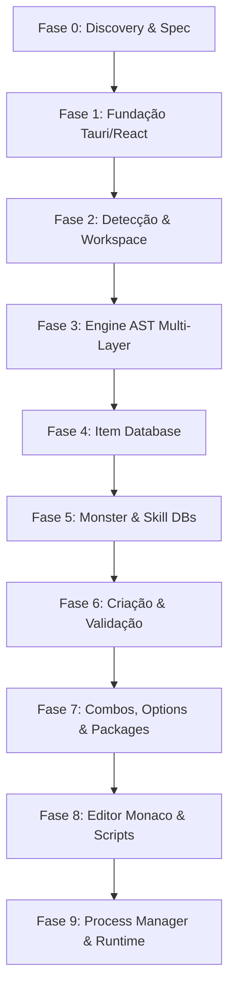

# rAthena Studio — Plano Mestre de Desenvolvimento

## 1. Visão do Projeto

O rAthena Studio é uma aplicação desktop profissional para desenvolvimento, edição, validação e gerenciamento de servidores rAthena.

O objetivo NÃO é criar apenas um editor de YAML.

O objetivo é construir um ambiente integrado de desenvolvimento para rAthena, permitindo:
- Gerenciar databases YAML do rAthena.
- Editar Items, Monsters, Skills, Quests, Instances e demais databases de forma estruturada.
- Validar estrutura e conteúdo dos databases contra regras do emulador.
- Detectar referências quebradas entre databases.
- Pesquisar rapidamente grandes volumes de dados (25.000+ registros).
- Preservar 100% da integridade e formatação original dos arquivos YAML (Textual Round-Trip).
- Visualizar e gerenciar processos do servidor (Login/Char/Map).
- Integrar Git ao fluxo de desenvolvimento de forma opcional.

---

## 2. Princípios Fundamentais

### 2.1 Segurança dos Dados
O aplicativo jamais deve modificar silenciosamente arquivos do usuário ou corromper formatações. Toda escrita no AST do YAML preserva comentários, espaçamentos e estilos literais de script (`Script: |`).

### 2.2 Source of Truth
Os arquivos do rAthena no repositório do usuário continuam sendo a única fonte de verdade. Não há banco de dados local intermediário proprietário.

### 2.3 Variante e Camadas
Isolamento estrito entre `Renewal` e `Pre-Renewal`. Suporte nativo à hierarquia de carregamento de camadas do rAthena (`BASE` → `MODE_SPECIFIC` → `IMPORT` → `CUSTOM`). Edições em campos herdados são automaticamente salvas na camada de `db/import/` para manter arquivos originais limpos.

---

## 3. Stack Tecnológica Oficial

- **Desktop Shell**: Tauri 2 (Rust)
- **Frontend**: React 19 + TypeScript
- **State Management**: Zustand
- **Virtualização**: `@tanstack/react-virtual`
- **Parsing/AST**: `yaml` (v2)
- **Estilização**: Tailwind CSS + Lucide Icons + Radix UI

---

## 4. Arquitetura

A estrutura interna do projeto é dividida em camadas desacopladas:

1. **UI & Presentation Layer**: Componentes React virtuais, painéis do Explorer, formulários de edição e modais de criação.
2. **State & Transaction Layer**: Lógica de sessão (`EditSession`), histórico de Undo/Redo (`Command Pattern`) e orquestração de transações (`TransactionService`).
3. **Database Workspace & Provider Layer**: Registry de providers, gerenciador de workspaces e carregadores de contextos de arquivos.
4. **Database Engine & CST Layer**: Parsers estruturados, serializadores AST, repositórios de herança de camadas e regras de validação semântica.
5. **Tauri IPC & Native Layer**: Acesso ao sistema de arquivos nativo do host.

---

## 5. Estrutura de Diretórios

```text
rathena-studio/
├── docs/
│   ├── database-engine/           # Especificações e requisitos de round-trip
│   ├── database-schema-audit.md   # Auditoria detalhada de campos e cobertura
│   └── plan.md                    # Este plano mestre atualizado
├── src/
│   ├── app/                       # Layout principal e inicializadores
│   ├── components/ui/             # Componentes reutilizáveis
│   ├── domain/database/           # Estrutura lógica de camadas, proveniência e sessões
│   ├── features/databases/        # Visualizações (Items, Monsters, Skills, Modais)
│   ├── services/database/         # Parsers, Serializers, Repositories e Transactions
│   ├── stores/                    # Zustand Stores (database, edits, workspaces)
│   └── utils/                     # Utilitários (semanticDiff, script helpers)
├── src-tauri/                     # Código Rust Tauri 2
├── tests/                         # Suíte completa de testes (Vitest)
└── package.json
```

---

## 6. Status e Fases de Desenvolvimento



### [x] Fase 0 — Discovery e Especificação (CONCLUÍDO)
- Estudo do parser do rAthena (`rapidyaml`), regras de herança e carregamento de imports.
- Definição do formato canônico do Header, Body e Footer.

### [x] Fase 1 — Fundação do Desktop (CONCLUÍDO)
- Setup do Tauri 2, React, TypeScript, Tailwind CSS e Vitest.

### [x] Fase 2 — Detecção de rAthena e Workspace (CONCLUÍDO)
- Estruturação do `WorkspaceStore` e fluxo de setup de diretório rAthena com detecção de variantes (`Renewal`/`Pre-Renewal`).

### [x] Fase 3 — Database Engine (CONCLUÍDO)
- Parser/Serializer usando AST via `yaml` v2 garantindo fidelidade de comentários, quebras de linhas e scripts.
- Resolução em camadas por campo (`FieldOrigin`) e detecção de proveniência.

### [x] Fase 4 — Item Database (CONCLUÍDO)
- CRUD completo de Itens, editor de subestruturas (`Flags`, `Trade`, `Delay`, `Stack`), checklist de Jobs/Classes e locais de equipamento.
- Rastreamento de proveniência de campos em tempo real.

### [x] Fase 5 — Monster e Skill Databases (CONCLUÍDO)
- **Monstros**: Editor de identidade, atributos, EXP, modos de IA detalhados e tabelas de Drops/MVP Drops com cálculo de taxa.
- **Skills**: Matrizes progressivas por nível (`SpCost`, `HpCost`, timings), catalisadores, requisitos de armas e área/unidade.
- Listagem virtualizada rápida para mais de 25.000 registros simultâneos.

### [x] Fase 6 — Transações, Diff Semântico e Criação (+1) (CONCLUÍDO)
- Histórico de Undo/Redo no nível do campo e mecanismo de **Discard** (reset).
- Engine de Diff Semântico recursivo com visualização estilo GitHub (linhas modificadas `-` e `+`).
- Adição de novos registros (`+ New Item/Monster/Skill`) com verificação em tempo real de ID e AegisName duplicados e auto-sugestão de próximo ID.
- Carregamento unificado com barra de progresso visual de status de leitura.

### [x] Fase 7 — Item Combos, Random Options, Item Groups & Packages (CONCLUÍDO)
- Parser e editor para `item_combos.yml`, `item_group_db.yml`, `item_packages.yml` e `item_randomopt_db.yml` / `item_randomopt_group.yml`.
- CRUD atômico em camadas e preservação estrita de AST.
- Referências cruzadas completas: relação reversa de itens aos seus combos, caixas/grupos e pacotes na aba do Item Inspector.
- Visualização e navegação de 7 bancos de dados com barra de progresso unificada.

### [x] Fase 8 — YAML Text Editor & Monaco Integration (CONCLUÍDO)
- **Monaco Raw YAML Editor**: Visualização e edição textual raw de qualquer arquivo YAML de banco de dados com árvore de arquivos por camadas (`[BASE]`, `[RE]`, `[PRE-RE]`, `[IMPORT]`), abas múltiplas, indicador de alterações não salvas (`●`) e atalho de salvamento (`Ctrl+S`).
- **Sincronização Bidirecional AST**: Salvamento atômico no disco com validação sintática via `yaml.parseDocument`, atualização em memória do `YamlDocumentAdapter` e recarga automática do provedor no `DatabaseRegistry`.
- **Tokenizador e IntelliSense de Scripts rAthena**: Linguagem personalizada `rathena-script` no Monaco com regras Monarch para palavras-chave, constantes e operadores; provedor de autocompletion com expansão em snippets (`ALL_SCRIPT_COMPLETIONS`) e provedor de hover documentation.
- **Validação Sintática em Tempo Real**: Diagnósticos com marcadores de erro e aviso no Monaco via `RathenaScriptValidator.validate(code)`.
- **Navegação Cruzada Instantânea (Jump to Entity)**: Botão "YAML" em todos os 7 inspetores visuais (`ItemInspector`, `MobInspector`, `SkillInspector`, `ComboInspector`, `ItemGroupInspector`, `ItemPackageInspector`, `RandomOptionInspector`) abrindo o arquivo exato e focando o cursor diretamente na linha de definição da entidade via `findEntityLineInYaml`.
- **Monaco Integrado nos Inspetores**: Componente `MonacoScriptEditor` integrado diretamente no `ItemScriptEditorSection`, `ComboInspector` e `RandomOptionInspector`.

### [ ] Fase 9 — Process Manager & rAthena Runtime (PRÓXIMA FASE)
- Inicialização e monitoramento de Login, Char e Map servers do rAthena.
- Captura de logs e stdout/stderr integrados em console.

---

## 7. Suíte de Testes e Qualidade

- **Cobertura**: 134 testes em 23 suítes cobrindo parsing de dados reais do rAthena/HorizonRO, round-trip AST, transações de edição, validadores, fluxos de criação de entidades, tokenizadores Monaco e localizadores de linhas YAML.
- **Integração contínua**: Validação via typecheck estrito (`tsc --noEmit`), lint (`eslint`) e build de produção.

---

## 8. Definition of Done (DoD)

Uma tarefa ou fase é considerada entregue apenas quando:
1. Compila sem erros TypeScript ou avisos no linter.
2. Preserva comentários e formatação YAML original ao salvar no disco.
3. Possui testes de unidade e integração cobrindo fluxos felizes e limites de erro.
4. Passa na validação de unicidade de dados (ID / AegisName).
5. Mantém a responsividade da UI (scroll virtual de 60 FPS).
